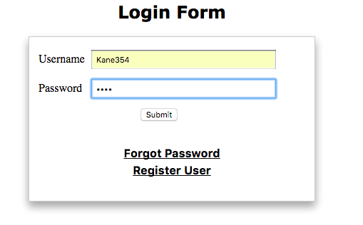
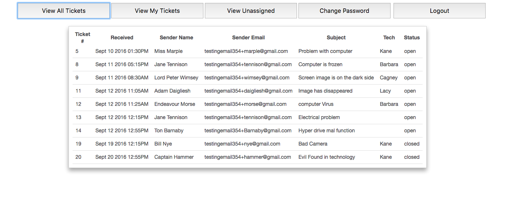
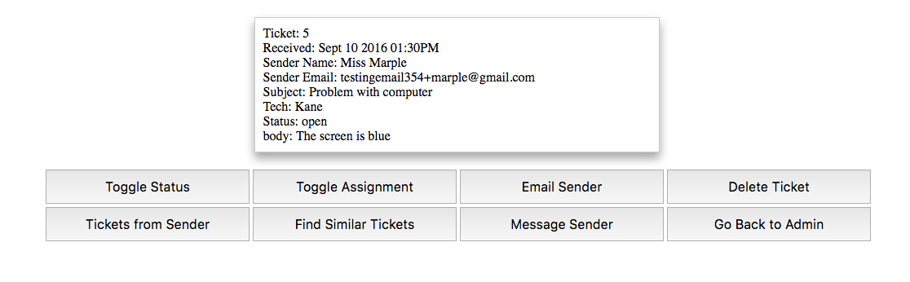
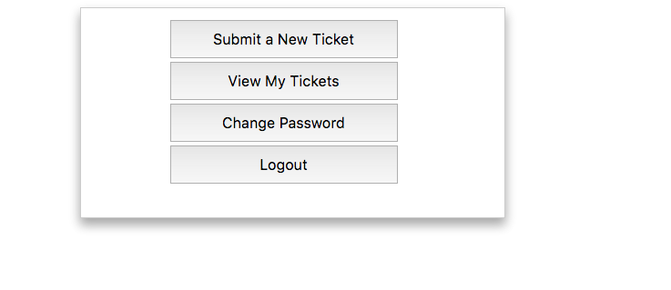

# Ticket System for Tech Support
This application supports all the basic functionality for administrators to manage their issues and for customers to place issues. It utilizes the twilio text messaging api on the admin side.  

##Login page
Both the Admins and Customers can log in to their respective accounts from here. There is a register user option, which can only be used to add new customer accounts. There is also a forgot password option that will send an email to an address on file to reset the password.

## Admin Functionality
On the admin page, tickets can be viewed in a table by hitting one of three buttons (View All Tickets, View My Tickets, and View Unassigned). The resulting table can be sorted by Ticket #, Time Received, Sender Name, Sender Email, Subject, Assigned Admin, and Status. There is also an option to change passwords and logout.

Specifics of the an individual ticket can be viewed by clicking on it. This will reveal the body of the ticket, along with 8 options: Toggle Status, Toggle Assignment, Email Sender, Delete Ticket, Ticket from Sender, Find Similar Tickets, Message Sender, Go Back to Admin.

The function of each is explained below:  
Toggle Status: Switches an open ticket to a closed ticket and vice versa. If a ticket is closed, the customer is notified via email.  
Toggle Assignment: Removes an admin from a ticket if they are on it or add them is it does not have an admin.   
Email Sender: Provides a form so that the customer can be emailed.  
Delete Ticket: Removes the ticket from the ticketing system  
Ticket from Sender: Finds all tickets from the same sender  
Find Similar Tickets: Finds tickets with a word or more in common with the current ticket  
Message Sender: Provides a form to send the user a text message  
Go Back to Admin: Takes you back to the original admin page

## Customer Functionality
There are 2 options for customers:  
Submit a New Ticket: Provides a form to create a ticket  
View My Tickets: Shows all tickets associated with the customer  
In addition, there is a change password and logout button

## Code Documentation
####Start:
index.html  
automatically redirects the user to the initialization script

####Initialization:
Main File: initME.PHP  
Supporting files: admin.txt, ticket.txt  
initMe sets up the tickets database and initializes two tables, admin and tickets.  
These tables will be filled with dummy data from the txt files

tickets.txt  
format: ticketID#name#emailAddress#subject#adminName#body#status#adminID#phoneNumber  
admin.txt  
format: password#emailAddress#username#name#userType

####Login Page:
Main File: admin.php  
Supporting files: forget.php, register.php, processUser.php
This file handles the login for both types of users. Upon successful login, it redirects to either the the admin page or the customer page.

####Admin Page:
Main File: admin_user.php  
Supporting files: processUser.php, selectedFunctions.php, message.php, changePassword.php
This file handles all of the functionality for the admin user. The supporting files handle the ajax requests made by this file.

####Customer Page:
Main File: regular_user.php  
Supporting files: processUser.php, changePassword.php, ticket.php
This file handles all of the functionality for the regular user. The supporting files
handle the ajax requests made by this file.

## Testing
To test this application, the following dummy users can be used. Please note that the following application was tested on XAMPP.

Admin:  
username: Kane354  
password: Kane

Customer:  
username: Fake1354  
password: Fake1

Testing Email Account:  
username: testingemail354@gmail.com  
password: TicketingSystem

To test this application, the following values may need to be set:

In forget.php, line 21, assure that the correct location to resetPassword.php is set. The below shows the current assumption.
$url = "http://localhost/TicketingSystem/src/resetPassword.php/?id="."$id";  

In messages.php, the Twilio account information must be set.
Line 4: "AccountSid" must be set  
Line 5: "AuthToken" must be set  
Line 7: "from" phone number must be set  

Note: All of the Ajax requests in both user pages are done through processUser.php

## Example Images

  
  
  
  

